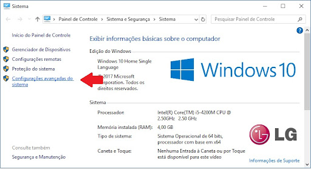
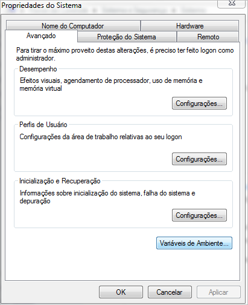
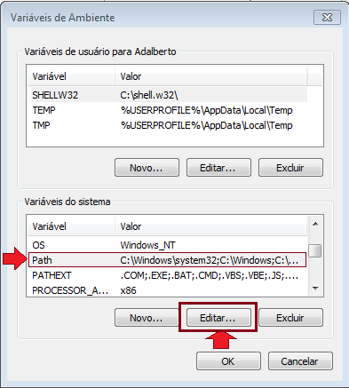
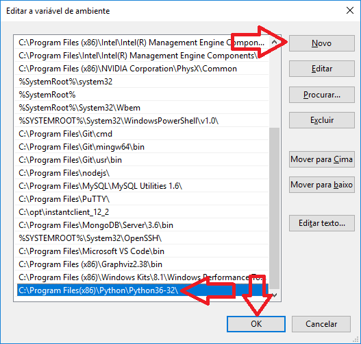
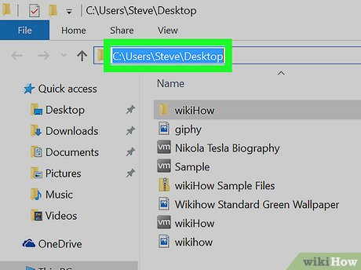

<h1 align="left">  #Lista de Tarefas-1: Um mergulho em Lógica de Programação com JavaScript </h1>

<h2>Introdução</h2>

A lista de exercícios 1 consiste em 16 desafios de Lógica com Javascript que contemplam as operações fundamentais, estruturas de controle condicional e de repetição.

<h2>Configuração do Ambiente</h2>


<p>Antes de começar, certifique-se de ter o Node.js instalado em sua máquina. Você pode baixá-lo e instalá-lo a partir do <a href="https://nodejs.org/en/"> site oficial do Node.js.</a></p>

<h3>Instalando Node JS no Windows</h3>

<p>Execute o instalador baixado no site oficial do node, siga as instruções na tela e pronto, o Node está instalado e adicionado ao PATH do Windows. Feche todos os terminais abertos e você está pronto para prosseguir. Para verificar a versão do Node ou se ele foi instalado corretamente basta executar o seguinte comando: </p>

```
node --version ou node -v
```

<h4>Caso o node não seja reconhecido</h4>
<ul>Acesse: 
<li>Painel de Controle / Sistema e Segurança / Sistema / Configurações Avançadas do Sistema</li>


<li>Propriedades do Sistema</li>
<p>Clique no botão -> Variáveis de Ambiente</p>



<li>Varáveis de Ambiente:</li>
<p>- Clique na variável Path e depois em editar.</p>



<p>Depois disso é só clicar em novo e adicionar caminho.</p>



<p>Um exemplo de como pegar o caminho para adicionar no Path, basta apenas copiar o caminho desejado:</p>



No caso do node poderia ser: 
<p>C:\Program Files\nodejs</p>
Depois é só clicar ok em todas as janelas.
</ul>

<p>Depois é abrir o terminal e verificar a versão instalada com os seguintes comandos: </p>

```
node --version ou node -v
```


<h3>Instalando pacotes com NPM</h3>
<p>O NPM é o gerenciador de pacotes do Node que vem junto em sua instalação. Para verificar a versão do NPM instalada, você pode executar o seguinte comando:</p>

```
npm --version ou npm -v
```

<h4>Utizando prompt-sync</h4>
<p>O prompt-sync é um módulo para Node.js que permite solicitar entradas do usuário. Para instalá-lo basta digitar o seguinte comando no terminal:</p>

```
npm install prompt-sync
```
Para utilizá-lo num arquivo js para entrada de dados, use no início do arquivo a seguinte linha de código:
```
const prompt = require('prompt-sync')();
```

<h2>Executando os Exercícios</h2>

1- Caso você tenha o git instalado e saiba usá-lo, Clone este repositório em sua máquina local usando o seguinte comando:
```
git clone <url do repositório>
```
Mas se você não tiver o git, basta apenas acessar o repositório, depois clicar num botão verde chamado Code, e clicar na opção download zip. O arquivo compactado será baixado em sua máquina. Basta apenas descompactar e usá-lo. A imagem mostra o procedimento.


2- Navegue até o diretório do projeto:
```
cd seu-repositorio
```
3- Instale o prompt-sync na pasta do projeto para entrada de dados usando o seguinte comando:
```
npm install prompt-sync
```
4- Cada exercício está localizado em seu próprio arquivo JavaScript com o numero respectivo a cada questão. Abra o arquivo do exercício que deseja executar em seu editor de código preferido.

5- Abra um terminal na pasta do projeto e execute o arquivo JavaScript usando o Node.js. Por exemplo, para executar o exercício "exec_1.js", use o seguinte comando:
```
node exec_1.js
```
6- O resultado do exercício será exibido. 

<p>Exibindo resultado no terminal do Visual Studio Code:</p>

<video src="https://github.com/devlavanere/Lista-Tarefas-1/assets/125924854/e42f0d1e-66ed-4c51-a3b4-e458749acd30" controls></video>

Caso deseje usar o cmd do windows:

<video src="https://github.com/devlavanere/Lista-Tarefas-1/assets/125924854/5e94eaba-d659-48b5-810a-d72e8daee903" controls></video>

<h2><strong>Enuciado dos Desafios e Respectivas Resoluções</strong></h2>

<h2>Desafio 1</h2>

Este desafio consiste em escrever um algoritmo para ler uma temperatura em graus Celsius, calcular e escrever o valor correspondente em graus Fahrenheit.

```
//Cria uma função chamada 'prompt' que permite solicitar entrada do usuário de forma síncrona
const prompt = require('prompt-sync')();

//Entrada de dados usando parseFloat para entrada de números reais 
let temperatura_celsius = parseFloat(prompt('Digite a temperatura em graus Celsius: '));

//Calculo para transformar Celsius em Fahrenheit
let transforma_celsius_fahrenheit = temperatura_celsius * 1.8 + 32;

//Saída do resultado da tranformação no console
console.log("A temperatura em Fahrenheit é: ", transforma_celsius_fahrenheit);
```

<h2>Desafio 2</h2>

Este desafio consiste em escrever um algoritmo para ler o número de eleitores de um município, o número de votos brancos, nulos e válidos. Calcular e escrever o percentual que cada um representa em relação ao total de eleitores.

```
//Cria uma função chamada 'prompt' que permite solicitar entrada do usuário de forma síncrona
const prompt = require('prompt-sync')();

//Utilizando parseInt() para entrada de números inteiros
let total_eleitores = parseInt(prompt('Digite o numero de eleitores: '));
let votos_brancos = parseInt(prompt('Digite o numero de votos brancos: '));
let votos_nulos = parseInt(prompt('Digite o numero de votos nulos: '));
let votos_validos = parseInt(prompt('Digite o numero de votos válidos: '));

//Cálculo dos percentuais
let percentual_votos_brancos = (votos_brancos / total_eleitores) * 100;
let percentual_votos_nulos = (votos_nulos / total_eleitores) * 100;
let percentual_votos_validos = (votos_validos / total_eleitores) * 100;

//Exibição do resultado dos pencentuais no console
console.log(`O percentual de votos brancos é ${percentual_votos_brancos}%`);
console.log(`O percentual de votos nulos é ${percentual_votos_nulos}%`);
console.log(`O percentual de votos válidos é ${percentual_votos_validos}%`);

```

<h2>Desafio 3</h2>

Esse desafio consiste em criar um algoritmo que leia quatro números inteiros e realize as seguintes operações:

● Some 25 ao primeiro inteiro;

● Triplique o valor do segundo inteiro;

● Modifique o valor do terceiro inteiro para 12% do valor original;

● Armazene no quarto inteiro a soma dos valores originais (os que o usuário digitou) dos primeiros três inteiros.

```
//Cria uma função chamada 'prompt' que permite solicitar entrada do usuário de forma síncrona
const prompt = require('prompt-sync')();

//Utilizando parseInt() para entrada de números inteiros
let numero_1 = parseInt(prompt('Digite o primeiro número: '));
let numero_2 = parseInt(prompt('Digite o segundo número: '));
let numero_3 = parseInt(prompt('Digite o terceiro número: '));
let numero_4 = parseInt(prompt('Digite o quarto número: '));

//Varável para guardar os três primeiros numeros originais
let soma_numeros = numero_1 + numero_2 + numero_3;

//Processamento dos cálculos pedidos nas questões
numero_1 += 25;
numero_2 *= 3;
numero_3 *= 0.12;
numero_4 += soma_numeros;

//Saída de dados no console
console.log(numero_1);
console.log(numero_2);
console.log(numero_3);
console.log(numero_4);

```

<h2>Desafio 4</h2>

Este desafio consiste em escrever  um algoritmo para ler as notas das duas avaliações de um aluno no semestre, calcular e escrever a média semestral e a seguinte mensagem: ‘PARABÉNS! Você foi aprovado’, somente se o aluno foi aprovado (considere 6.0 a nota mínima para aprovação).

```
//Cria uma função chamada 'prompt' que permite solicitar entrada do usuário de forma síncrona
const prompt = require('prompt-sync')();

//Utilizando parseFloat para entrada de numeros reais
let nota_1 = parseFloat(prompt('Digite a primeira nota: '));
let nota_2 = parseFloat(prompt('Digite a segunda nota: '));

//Processamento cálculo da soma e da média
let soma = nota_1 + nota_2;
let media = soma / 2;

//Variável inicializada com uma string vázia
let mensagem = "";

//Condicao para a exibição da mensagem
if(media >= 6){
    mensagem = "PARABÉNS! Você foi aprovado";
}

//Saída no console
console.log(mensagem);
```

<h2>Desafio 5</h2>

Acrescenta ao exercício anterior a mensagem ‘Você foi REPROVADO! Estude mais’ caso a média calculada seja menor que 6,0.

```
//Cria uma função chamada 'prompt' que permite solicitar entrada do usuário de forma síncrona
const prompt = require('prompt-sync')();

//Utilizando parseFloat para entrada de numeros reais
let nota_1 = parseFloat(prompt('Digite a primeira nota: '));
let nota_2 = parseFloat(prompt('Digite a segunda nota: '));

//variável inicializada com uma string vazia
let mensagem = "";

//Processamento cálculo da soma e da média
let soma = nota_1 + nota_2;
let media = soma / 2;

//Condição para seguir o fluxo
if(media >= 6){
    mensagem = "PARABÉNS! Você foi aprovado";
}
else{
    mensagem = "Você foi REPROVADO! Estude mais";
}

//Saída no console
console.log(mensagem);
```

<h2>Desafio 6</h2>

Ler três valores para os lados de um triângulo: A, B e C. Verificar se os lados fornecidos formam realmente um triângulo. Caso forme, deve ser indicado o tipo de triângulo:
Isósceles, escaleno ou eqüilátero.
Para verificar se os lados fornecidos formam triângulo: A < B + C e B < A + C e C < A + B

Triângulo isósceles: possui dois lados iguais (A=B ou A=C ou B = C)

Triângulo escaleno: possui todos os lados diferentes (A<>B e B <> C)

Triângulo eqüilátero: possui todos os lados iguais (A=B e B=C)

```
//Cria uma função chamada 'prompt' que permite solicitar entrada do usuário de forma síncrona
const prompt = require('prompt-sync')();

//Utilizando parseFloat para entrada de numeros reais
let A = parseFloat(prompt('Digite o valor do lado A: '));
let B = parseFloat(prompt('Digite o valor do lado B: '));
let C = parseFloat(prompt('Digite o valor do lado C: '));

//Cria a variável tipo, mas não define nenhum valor para ela
let tipo;

// Verificar se os lados fornecidos formam um triângulo
if (A < B + C && B < A + C && C < A + B) {
    // Verificar o tipo de triângulo
    if (A === B && B === C) {
        tipo = "Triângulo equilátero";
    } else if (A === B || A === C || B === C) {
        tipo = "Triângulo isósceles";
    } else {
        tipo = "Triângulo escaleno";
    }
}
//Imprimir a mensagem no console de acordo com o tipo de triângulo
console.log(tipo);
```

<h2>Desafio 7</h2>

As maçãs custam R$ 0,30 se forem compradas menos do que uma dúzia, e R$ 0,25 se forem compradas pelo menos doze. Escreva um algoritmo que leia o número de maçãs compradas, calcule e escreva o valor total da compra.

```
//Cria uma função chamada 'prompt' que permite solicitar entrada do usuário de forma síncrona
const prompt = require('prompt-sync')();

//Utilizando parseFloat para entrada de um numero real
let macas_compradas = parseFloat(prompt('Digite a quantidade de maçãs compradas: '));

//Variável foi criada, mas nenhum valor foi definido
let valor_total;

//Condição para saber se foram compradas menos que uma dúzia ou mais de uma dúzia
if(macas_compradas < 12) {
    valor_total = macas_compradas * 0.30;
}
else {
    valor_total = macas_compradas * 0.25;
}

//Imprimindo o valor total no console
console.log("O valor total da compra é: ", valor_total);
```

<h2>Desafio 8</h2>

Neste desafio deve ser escrito um algoritmo para ler 2 valores (considere que não serão lidos valores iguais) e escreve-los em ordem crescente.

```
//Cria uma função chamada 'prompt' que permite solicitar entrada do usuário de forma síncrona
const prompt = require('prompt-sync')();

//Utilizando parseInt() para entrada de números inteiros
let valor_1 = parseInt(prompt('Digite o primeiro valor: '));
let valor_2 = parseInt(prompt('Digite o segundo valor: '));

//Variável foi criada, mas nenhum valor foi definido
let ordem_crescente;

//Condicao para estabelecer a ordem crescente
if(valor_1 < valor_2) {
    ordem_crescente = valor_1 +" -> "+ valor_2;
}
else{ 
    ordem_crescente = valor_2 +" -> "+ valor_1;
}

//Imprime no console os valores em ordem crescente
console.log(ordem_crescente);
``` 

<h2>Desafio 9</h2>

Este desafio é para escrever um algoritmo que leia o código de origem de um produto e imprima a região do mesmo, conforme a tabela abaixo:
Código de Origem:
1- Sul | 2- Norte | 3- Leste | 4- Oeste | 5 ou 6 - Nordeste | 7, 8 ou 9- Sudeste | 
10 até 20- Centro-Oeste | 25 até 50- Nordeste | Fora dos Intervalos- Produtos Importados

```
//Cria uma função chamada 'prompt' que permite solicitar entrada do usuário de forma síncrona
const prompt = require('prompt-sync')();

//Utilizando parseInt() para entrada de um número inteiro
let codigo_origem = parseInt(prompt('Digite o código de origem do produto: '));

let regiao = '';

//Condição para interligar código de origem a região
if(codigo_origem === 1){
    regiao = 'Sul';
} else if(codigo_origem === 2) {
    regiao = 'Norte';
} else if(codigo_origem === 3) {
    regiao = 'Leste';
} else if(codigo_origem === 4) {
    regiao = 'Oeste'
} else if((codigo_origem === 5 || codigo_origem === 6) || (codigo_origem >= 25 && codigo_origem <= 50)) {
    regiao = 'Nordeste';
} else if(codigo_origem >= 7 && codigo_origem <= 9) {
    regiao = 'Sudeste';
} else if(codigo_origem >= 10 && codigo_origem <= 20) {
    regiao = 'Centro-Oeste';
} else {
    console.log('Produto Importado');
}

//Imprime no console o código digitado e sua respectiva Região
console.log("Região =", regiao);
```

<h2>Desafio 10</h2>

Este desafio deve Escrever um algoritmo para ler um número inteiro e escrevê-lo na tela 10 vezes.

```
//Cria uma função chamada 'prompt' que permite solicitar entrada do usuário de forma síncrona
const prompt = require('prompt-sync')();

//Utilizando parseInt() para entrada de um numero inteiro
let numero = parseInt(prompt('Digite um numero inteiro: '));

//Laço de repetição para imprimir no console o numero digitado 10 vezes
for(let i = 1; i <= 10; i++){
    console.log(numero);
}
```

<h2>Desafio 11</h2>

Escreva um algoritmo para ler uma quantidade indeterminada de valores inteiros. Para cada valor fornecido escrever uma mensagem que indica se cada valor fornecido é PAR ou ÍMPAR. O algoritmo será encerrado imediatamente após a leitura de um valor NULO ou NEGATIVO.

```
//Cria uma função chamada 'prompt' que permite solicitar entrada do usuário de forma síncrona
const prompt = require('prompt-sync')();

console.log('Digite uma série de valores para encerrar digite "0" ou um numero Negativo:')
console.log('***************************************************************************');

//Laço deve continuar enquanto verdadeiro
while(true) {
    //Utilizando parseInt() para entrada do valor inteiro
    const valor = parseInt(prompt('Digite um valor inteiro: '));
    //Caso o valor inteiro seja 0 ou Negativo o break encerra o loop
    if(valor <= 0){
        console.log('Encerrando...')
        break;
    }
    else if(valor % 2 === 0) {
        console.log('Par');
    }
    else{
        console.log('Ímpar');
    }
}
```

<h2>Desafio 12</h2>

Escreva um algoritmo que gere os números de 1000 a 1999 e escreva aqueles que, divididos por 11, dão resto igual a 5.

```
//Laço for percorrer numeros de 1000 a 1999
for(let numero = 1000; numero <= 1999; numero++) {
    //Condição para que os números divididos por 11 e tenham resto igual a 5 sejam impressos no console
    if(numero % 11 === 5) {
        console.log(numero);
    }
}
```

<h2>Desafio 13</h2>

Escrever um algoritmo que leia 5 valores para uma variável N e, para cada um deles, calcule e mostre a tabuada de 1 até N. Mostre a tabuada na forma:

1 x N = N

2 x N = 2N

3 x N = 3N

```
//Cria uma função chamada 'prompt' que permite solicitar entrada do usuário de forma síncrona
const prompt = require('prompt-sync')();

let contador = 0;

// Loop externo para pegar os cinco números
while (contador < 5) {
    //Utilizando parseInt() para entrada de números inteiros
    let N = parseInt(prompt('Digite um número: '));
    
    // Loop para calcular e mostrar a tabuada de 1 até N
    for (let i = 1; i <= N; i++) {
        // Calculando o resultado da multiplicação
        let resultado = i * N;
        
        // Exibindo a multiplicação e seu resultado usando template string
        console.log(`${i} x ${N} = ${resultado}`);
    }
    
    contador++;
}
```

<h2>Desafio 14</h2>

Fazer um algoritmo para receber números decimais até que o usuário digite 0 e fazer a média aritmética desses números.

```
//Cria uma função chamada 'prompt' que permite solicitar entrada do usuário de forma síncrona
const prompt = require('prompt-sync')();

let total = 0;
let quantidade = 0;
let numero;

console.log("Digite os números decimais (digite 0 para sair):");

// Laço enquanto o usuário não digitar 0
while (true) {
  //Utilizando parseFloat() para entrada de número decimal  
  numero = parseFloat(prompt("Digite um número decimal:"));

  // Verifica se o número é 0 para sair do loop
  if (numero === 0) {
    break;
  }

  // Adiciona o número ao total e incrementa a quantidade
  total += numero;
  quantidade++;
}

// Calcula a média aritmética
const media = total / quantidade;

// Exibe a média no console
console.log("A média aritmética dos números digitados é:", media);
```

<h2>Desafio 15</h2>

Fazer um algoritmos para receber um número decimal e o peso de cada número até que o usuário digite o número 0. Fazer a média ponderada desses números e pesos respectivos.

```
console.log("Digite o número decimal e seu peso (digite '0' para encerrar):");

//Laço enquanto o usuário não digitar 0
while (true) {
    const numero = parseFloat(prompt("Digite o número decimal: "));
    
    // Verifica se o número é zero para encerrar o loop
    if (numero === 0) {
        break;
    }
    
    const peso = parseFloat(prompt("Digite o peso do número: "));
    
    // Adiciona o produto do número pelo peso à soma dos produtos
    somaProdutos += numero * peso;
    
    // Adiciona o peso à soma dos pesos
    somaPesos += peso;
}

// Calcula a média ponderada
const mediaPonderada = somaProdutos / somaPesos;

//Imprime no console a média ponderada com duas casa decimais
console.log("A média ponderada dos números e pesos fornecidos é:", mediaPonderada.toFixed(2));

```

<h2>Desafio 16</h2>

Escreva um algoritmo para imprimir os 50 primeiros número primos maior que 100.
Obs.: Número primo é aquele divisível somente por 1 e ele mesmo.

```
//Inicializa-se a variável contadorPrimos para verificar quantos números primos foram encontrados
let contadorPrimos = 0;
let numero = 101;

//O laço de repetição while continua até chegar nos 50 números
while (contadorPrimos < 50) {
  //Variável booleana assume que o número atual é primo
  let ehPrimo = true;

  //O laço for itera através de todos os possíveis divisores do número atual, de 2 até a raiz quadrada do número atual
  for (let divisor = 2; divisor <= Math.sqrt(numero); divisor++) {
    // verifica se o número atual é divisível por algum dos seus possíveis divisores.
    if (numero % divisor === 0) {
      //Se for divisível sai do laço com o break
      ehPrimo = false;
      break;
    }
  }
  //Se nenhum divisor for encontrado, ehPrimo é verdadeiro, imprime o numero e incrementa contadorPrimos
  if (ehPrimo) {
    console.log(numero);
    contadorPrimos++;
  }

  numero++;
}
```

<h2>Desenvolvedor</h2>

[<br><sub>Michel L. Sampaio</sub>](https://github.com/devlavanere)
